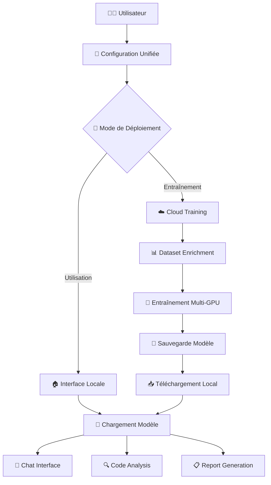

# 🛡️ BYJY-LLM - LLaMA Cybersécurité Unifié

## 🌟 **Système LLM Hybride Local/Cloud pour la Cybersécurité**

**BYJY-LLM** est un système d'intelligence artificielle avancé spécialisé en cybersécurité, offrant une architecture **hybride innovante** :
- **🌩️ Entraînement Cloud** : Utilise les ressources cloud pour l'entraînement intensif
- **🏠 Utilisation Locale** : Déploie le modèle entraîné localement pour l'inférence sécurisée
- **🔄 Synchronisation Automatique** : Workflow seamless entre cloud et local

---

## ⚡ **Fonctionnalités Principales**

### 🧠 **Intelligence Avancée**
- **Auto-détection de plateforme** : Colab, AWS, Azure, GCP, Kaggle, Paperspace
- **Optimisation automatique** selon le hardware disponible (GPU/CPU/RAM)
- **Dataset enrichment intelligent** : 5000+ exemples générés automatiquement
- **Monitoring temps réel** avec alertes intelligentes

### 🛡️ **Spécialisation Cybersécurité**
- **Génération de règles** : YARA, Sigma, Snort, Suricata
- **Analyse de logs** : Détection d'attaques, forensics
- **Audit de code** : Détection de vulnérabilités multi-langages
- **Threat Intelligence** : MITRE ATT&CK, IOC analysis
- **Incident Response** : Playbooks automatisés

### 🏠 **Interface Locale Moderne**
- **Chat en temps réel** avec streaming WebSocket
- **Interface web moderne** : Thème sombre/clair, responsive
- **Analyse multi-fichiers** : Upload et analyse de projets complets
- **Rapports automatisés** : PDF/HTML avec visualisations
- **API REST complète** : Intégration facile

### 🔧 **Système Extensible**
- **Plugins modulaires** : Code analyzer, vulnerability scanner, report generator
- **Base de données intégrée** : SQLite avec historique complet
- **Configuration unifiée** : Un seul fichier de configuration
- **Sécurité renforcée** : Validation, sanitisation, protection CSRF/XSS

---

## 🚀 **Installation Rapide**

### **Option 1 : Installation Complète (Recommandée)**
```bash
# Clone du repository
git clone https://github.com/LeZelote01/BYJY-LLM.git
cd BYJY-LLM

# Installation automatique
chmod +x install.sh
./install.sh --complete

# Lancement de l'interface moderne
python local_deployment/modern_interface.py
```

### **Option 2 : Installation Express**
```bash
# Installation one-liner
curl -fsSL https://raw.githubusercontent.com/LeZelote01/BYJY-LLM/main/install.sh | bash -s -- --complete
```

### **Option 3 : Configuration Personnalisée**
```bash
# Configuration interactive
python quick_setup.py
```

---

## 🎯 **Utilisation**

### 1. **🌩️ Entraînement Cloud Hybride**

#### **Google Colab (Gratuit)**
```python
# Dans Google Colab
!git clone https://github.com/LeZelote01/BYJY-LLM.git
%cd BYJY-LLM

# Installation et entraînement automatique
!python cloud_training/unified_cloud_trainer.py --platform colab
```

#### **Plateformes Cloud Avancées**
```bash
# AWS SageMaker
python cloud_training/unified_cloud_trainer.py \
  --platform aws \
  --instance-type ml.p3.2xlarge \
  --epochs 5

# Azure ML
python cloud_training/unified_cloud_trainer.py \
  --platform azure \
  --vm-size Standard_NC6s_v3 \
  --config configs/unified_config.json
```

### 2. **🏠 Interface Locale Moderne**

#### **Lancement Standard**
```bash
# Interface web complète
python local_deployment/modern_interface.py

# Accès : http://localhost:8080
```

#### **Mode API**
```bash
# API REST uniquement
python local_deployment/modern_interface.py --api-only --port 8081
```

### 3. **💻 Utilisation via API**

#### **Chat avec l'Assistant**
```python
import requests

response = requests.post('http://localhost:8080/api/v2/chat', json={
    "message": "Créer une règle YARA pour détecter Mimikatz",
    "session_id": "user123",
    "stream": False
})

print(response.json()['response'])
```

#### **Analyse de Code**
```python
response = requests.post('http://localhost:8080/api/v2/analyze', json={
    "code": "SELECT * FROM users WHERE id = '" + user_input + "'",
    "language": "sql"
})

print(response.json()['vulnerabilities'])
```

#### **Upload et Analyse de Fichiers**
```python
files = {'files': open('vulnerable_code.py', 'rb')}
response = requests.post('http://localhost:8080/api/v2/upload', files=files)

print(response.json()['analysis_results'])
```

---

## 📊 **Architecture Technique**

### **Workflow Hybride Optimisé**


### **Stack Technologique**
```yaml
Backend:
  - Python 3.8+
  - PyTorch 2.0+
  - Transformers 4.30+
  - FastAPI / Flask
  - SQLite / PostgreSQL

Frontend:
  - HTML5 / CSS3 / JavaScript
  - WebSocket pour temps réel
  - Bootstrap / Tailwind CSS
  - Chart.js pour visualisations

ML/AI:
  - LLaMA-2/3 (7B/13B)
  - LoRA / QLoRA fine-tuning
  - PEFT (Parameter Efficient Fine-Tuning)
  - bitsandbytes quantization

Cloud:
  - Google Colab (gratuit)
  - AWS SageMaker
  - Azure ML
  - Google Cloud AI Platform
```

---

## 🛡️ **Exemples d'Utilisation Cybersécurité**

### **1. Génération de Règles de Détection**
```
Prompt: "Créer une règle Sigma pour détecter PowerShell malveillant"

Réponse:
title: PowerShell Suspicious Activity
id: 12345678-1234-1234-1234-123456789012
status: experimental
description: Détecte l'utilisation suspecte de PowerShell
detection:
    selection:
        EventID: 4104
        ScriptBlockText|contains:
            - 'Invoke-Expression'
            - 'DownloadString'
            - 'EncodedCommand'
    condition: selection
level: medium
```

### **2. Analyse de Logs d'Attaque**
```
Prompt: "Analyser ce log Apache pour identifier une injection SQL"
Input: '192.168.1.100 - - [10/Jan/2024] "GET /login.php?user=admin' OR '1'='1'--"'

Réponse:
🚨 ATTAQUE DÉTECTÉE : Injection SQL
- IP Source: 192.168.1.100  
- Payload: admin' OR '1'='1'--
- Type: Union-based SQL Injection
- Recommandations: Bloquer IP, valider paramètres, requêtes préparées
```

### **3. Audit de Code Sécurisé**
```python
# Code vulnérable analysé
query = f"SELECT * FROM users WHERE username = '{username}'"
cursor.execute(query)

# Réponse de l'IA
❌ VULNÉRABILITÉ CRITIQUE: Injection SQL
✅ CORRECTION:
cursor.execute("SELECT * FROM users WHERE username = ?", (username,))
```

---

## ⚙️ **Configuration Avancée**

### **Configuration Unifiée**
```json
{
  "deployment": {
    "mode": "hybrid",
    "local_enabled": true,
    "cloud_enabled": true,
    "priority": "local"
  },
  "model": {
    "name": "meta-llama/Llama-2-7b-hf",
    "max_seq_length": 2048,
    "preferred_format": "gguf"
  },
  "inference": {
    "temperature": 0.7,
    "max_tokens": 512,
    "streaming": true
  },
  "security": {
    "input_validation": true,
    "content_filtering": true,
    "rate_limiting": true
  }
}
```

### **Variables d'Environnement**
```bash
# Monitoring
export WANDB_API_KEY="your-wandb-key"
export WANDB_PROJECT="llama-cybersec"

# Alertes
export DISCORD_WEBHOOK_URL="your-discord-webhook"
export ALERT_EMAIL="admin@domain.com"

# Cloud
export AWS_REGION="us-east-1"
export AZURE_SUBSCRIPTION_ID="your-sub-id"
```

---

## 📈 **Performance et Optimisations**

### **Benchmarks**
```yaml
Entraînement:
  - Google Colab (T4): ~2-3h pour 3 époques
  - AWS p3.2xlarge: ~1-2h pour 3 époques
  - RTX 4090 local: ~45min pour 3 époques

Inférence:
  - CPU (16 cores): ~2-5s par réponse
  - GPU RTX 3080: ~0.5-1s par réponse
  - GPU RTX 4090: ~0.2-0.5s par réponse

Mémoire:
  - Modèle 7B quantifié: ~4GB RAM
  - Modèle 13B quantifié: ~8GB RAM
  - Interface web: ~200MB RAM
```

### **Optimisations Automatiques**
- **Quantification adaptative** : 4-bit/8-bit selon GPU
- **Batch size dynamique** : Optimisation selon mémoire disponible
- **Cache intelligent** : Réduction temps de chargement
- **Streaming** : Réponses en temps réel

---

## 🧪 **Tests et Validation**

### **Tests Automatisés**
```bash
# Tests système complets
python tests/validate_pipeline.py --comprehensive

# Tests de performance
python tests/benchmark_system.py --full

# Tests de sécurité
python tests/security_tests.py --all
```

### **Tests de Régression**
```bash
# Tests avant déploiement
python tests/regression_tests.py
python tests/api_tests.py
python tests/ui_tests.py
```

---

## 🔧 **Dépannage**

### **Problèmes Fréquents**

#### **Modèle ne se charge pas**
```bash
# Vérifier l'intégrité
python utils/model_manager.py --validate --model-id "llama-cybersec"

# Réinstaller si nécessaire
python utils/model_manager.py --install --model-id "llama-cybersec" --force
```

#### **Interface web inaccessible**
```bash
# Vérifier les ports
netstat -an | grep 8080

# Changer le port
python local_deployment/modern_interface.py --port 8081
```

#### **Erreur de mémoire GPU**
```json
// Réduire dans configs/unified_config.json
{
  "model": {
    "max_seq_length": 1024
  },
  "inference": {
    "batch_size": 1
  },
  "optimization": {
    "use_4bit_quantization": true
  }
}
```

#### **Dataset pas trouvé**
```bash
# Recréer le dataset
python scripts/dataset_manager.py --create-initial --enrich
```

---

## 🤝 **Contribution**

### **Comment Contribuer**
1. **Fork** le repository
2. **Créer** une branche feature (`git checkout -b feature/nouvelle-fonctionnalite`)
3. **Commit** les changes (`git commit -m 'Ajout nouvelle fonctionnalité'`)
4. **Push** vers la branche (`git push origin feature/nouvelle-fonctionnalite`)
5. **Créer** une Pull Request

### **Guidelines de Développement**
- Code formaté avec `black`
- Tests unitaires requis
- Documentation mise à jour
- Respect des patterns existants

### **Roadmap**
- [ ] Support modèles multimodaux (vision + texte)
- [ ] Interface vocale avec STT/TTS
- [ ] Plugin VS Code/JetBrains
- [ ] Support mobile (Android/iOS)
- [ ] Intégration Slack/Teams native
- [ ] Fédération de modèles distribués

---

## 📚 **Documentation Détaillée**

- 📋 **[Guide d'Installation](docs/INSTALLATION.md)** - Installation détaillée
- 🎯 **[Guide d'Utilisation](docs/GUIDE_UTILISATION.md)** - Utilisation complète
- 🔌 **[API Reference](docs/API.md)** - Documentation API REST
- ⚙️ **[Configuration](docs/CONFIGURATION.md)** - Options de configuration
- 👨‍💻 **[Développeurs](docs/DEVELOPMENT.md)** - Guide développeurs
- 🏗️ **[Architecture](docs/ARCHITECTURE.md)** - Architecture technique
- 🛡️ **[Sécurité](docs/SECURITY.md)** - Bonnes pratiques sécurité

---

## 📊 **Statistiques**


---

## 📄 **Licence**

Ce projet est sous licence **MIT**. Voir [LICENSE](LICENSE) pour plus de détails.

---

## 🙋‍♂️ **Support et Communauté**

### **Support Technique**
- 🐛 **[Issues GitHub](https://github.com/LeZelote01/BYJY-LLM/issues)** - Signaler un bug
- 💬 **[Discussions](https://github.com/LeZelote01/BYJY-LLM/discussions)** - Forum communautaire
- 📧 **Email** : support@byjy-llm.com

### **Réseaux Sociaux**  
- 🐦 **Twitter** : [@BYJY_LLM](https://twitter.com/BYJY_LLM)
- 💼 **LinkedIn** : [BYJY-LLM](https://linkedin.com/company/byjy-llm)
- 💬 **Discord** : [Serveur BYJY-LLM](https://discord.gg/byjy-llm)

---

## 🎯 **Citation**

Si vous utilisez BYJY-LLM dans vos recherches, veuillez citer :

```bibtex
@software{byjy_llm_2025,
  title = {BYJY-LLM: Système LLM Hybride Local/Cloud pour la Cybersécurité},
  author = {BYJY Team},
  year = {2025},
  url = {https://github.com/LeZelote01/BYJY-LLM},
  version = {2.0.0}
}
```

---

<div align="center">

**🛡️ BYJY-LLM - L'IA Cybersécurité de Nouvelle Génération**

*Entraînement Cloud • Utilisation Locale • Performance Maximale*

---

⭐ **N'oubliez pas de star le repo si BYJY-LLM vous aide !** ⭐

</div>